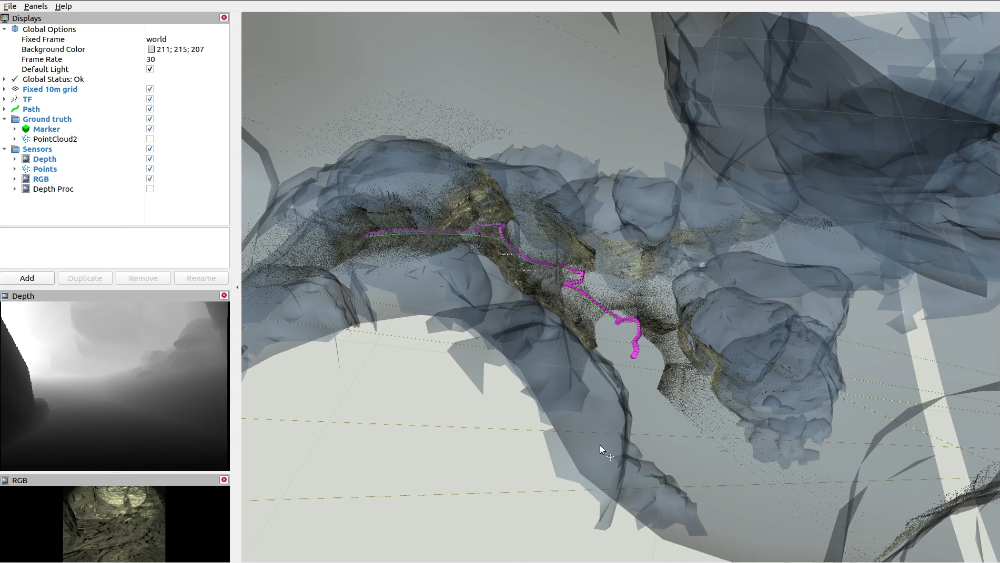

# Supervised Depth Correction

[](https://drive.google.com/file/d/1Dq5OAXP0lUvGvO_78CFOkJMAs1wdt622/view?usp=sharing)


## Data sample from Subt simulator

Download [RGB-D images](https://drive.google.com/drive/folders/1GuZr6nvmH1_-31vtszih9-CQowisk0VD?usp=sharing)

And place it to the folder:
```
./ros_ws/src/gradslam_ros/data/
```

Explore the depth images data from the simulator (requires
[Open3D](https://github.com/isl-org/Open3D)
installation):
[./notebooks/explore_data.ipynb](https://github.com/RuslanAgishev/supervised_depth_correction/blob/master/notebooks/explore_data.ipynb)

## Mapping with [GradSLAM](https://github.com/gradslam/gradslam)

Prerequisite: install [ROS](https://www.ros.org/)

Build the `gradslam_ros` wrapper node:
```bash
cd ./ros_ws/
catkin_make
source devel/setup.bash
```

Construct a map from RGBD images input:
```
roslaunch gradslam_ros bag_inference.launch odom:=gt
```

You may also want to visualize a ground truth mesh of the world by pacing the argument:
```pub_gt:=true```.
Note, that this option requires
[Pytorch3d](https://github.com/facebookresearch/pytorch3d)
installed.

## Mapping evaluation

***Prerequisite***: install [Pytorch3d](https://github.com/facebookresearch/pytorch3d)

Ground truth map from the simulator could be represented as a mesh file.

Download
[meshes](https://drive.google.com/drive/folders/1eB8sJmN4EknR7cjrke248aRFPaif8srg?usp=sharing)
of some cave worlds.
And place them in `./data/meshes/` folder.

Compare map to mesh [./notebooks/compare_gt_map_mesh_to_point_cloud.ipynb](https://github.com/RuslanAgishev/supervised_depth_correction/blob/main/notebooks/compare_gt_map_mesh_to_point_cloud.ipynb)

Please, follow the
[instructions](https://github.com/facebookresearch/pytorch3d/blob/master/INSTALL.md)
to install its dependencies.

It will compare a point cloud to a mesh using the following functions:
- the closest distance from
[point to mesh edge](https://pytorch3d.readthedocs.io/en/latest/modules/loss.html#pytorch3d.loss.point_mesh_edge_distance)
(averaged across all points in point cloud),
- the closes distance from
[point to mesh face](https://pytorch3d.readthedocs.io/en/latest/modules/loss.html#pytorch3d.loss.point_mesh_face_distance)
(averaged across all points in point cloud).