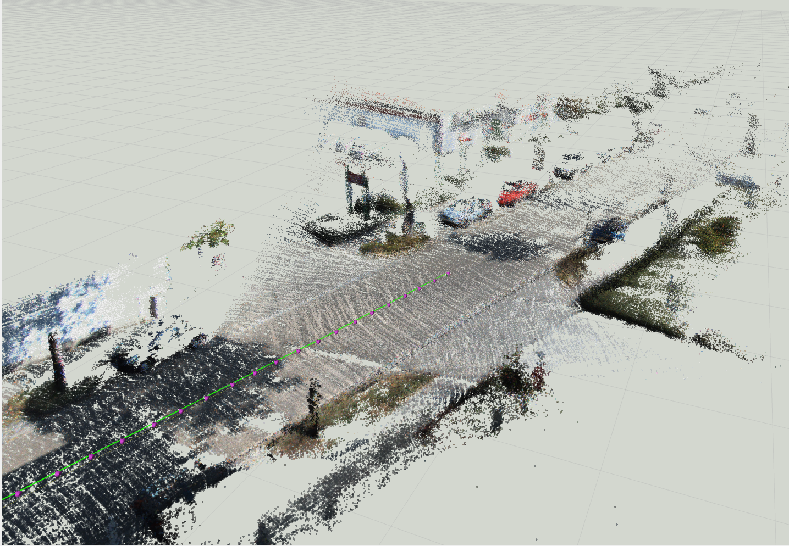

# [Supervised Depth Correction](https://docs.google.com/document/d/17J_ckwe_O4rgceCp6kVXL7DN4urH3mCqgWJ3b4MlOI4/edit?usp=sharing)


Please, follow the installation instruction in
[docs/install.md](https://github.com/RuslanAgishev/supervised_depth_correction/blob/main/docs/install.md)
before proceeding next.


## Differentiable SLAM and Subt simulator


Download [RGB-D images](https://drive.google.com/drive/folders/1Y1GSDI-Qo6XpZZPtUTi9ou2tghoYh5fr?usp=sharing)

And place it to the folder:
```
./data/
```

The data is organized in the same format as the [ICL-NUIM](https://www.doc.ic.ac.uk/~ahanda/VaFRIC/iclnuim.html)
dataset.

Explore the depth images data from the simulator (requires
[Open3D](https://github.com/isl-org/Open3D)
installation):
[./notebooks/explore_data.ipynb](https://github.com/RuslanAgishev/supervised_depth_correction/blob/master/notebooks/explore_data.ipynb)


### Mapping with [GradSLAM](https://github.com/gradslam/gradslam)

***Prerequisite***: install [ROS](https://www.ros.org/)

Construct a map from RGBD images input:
```
roslaunch supervised_depth_correction gradslam_bag.launch odom:=gt
```

You may also want to visualize a ground truth mesh of the world by passing the additional argument:
```pub_gt_mesh:=true```.
Note, that this option requires
[Pytorch3d](https://github.com/facebookresearch/pytorch3d)
installed.


### Mapping evaluation

***Prerequisite***: install [Pytorch3d](https://github.com/facebookresearch/pytorch3d/blob/master/INSTALL.md)

Ground truth map from the simulator could be represented as a mesh file.

Download
[meshes](https://drive.google.com/drive/folders/1S3UlJ4MgNsU72PTwJku-gyHZbv3aw26Z?usp=sharing)
of some cave worlds.
And place them to `./data/meshes/` folder.

Compare map to mesh
[./notebooks/compare_gt_map_mesh_to_point_cloud.ipynb](https://github.com/RuslanAgishev/supervised_depth_correction/blob/main/notebooks/compare_gt_map_mesh_to_point_cloud.ipynb)

It will compare a point cloud to a mesh using the following functions:
- the closest distance from
[point to mesh edge](https://pytorch3d.readthedocs.io/en/latest/modules/loss.html#pytorch3d.loss.point_mesh_edge_distance)
(averaged across all points in point cloud),
- the closes distance from
[point to mesh face](https://pytorch3d.readthedocs.io/en/latest/modules/loss.html#pytorch3d.loss.point_mesh_face_distance)
(averaged across all points in point cloud).


### Record the data

*Note, that this section requires installation of the
[DARPA Subt simulator](https://github.com/osrf/subt)
and the exploration pipeline.

However, you may use already prerecorded ROS *.bag files and convert them
to [ICL-NUIM](https://www.doc.ic.ac.uk/~ahanda/VaFRIC/iclnuim.html)
dataset format.

In order to record a bag-file, launch the simulator and simply run:
```bash
./scripts/record_bag.sh
```

You can download prerecorded data from
[here](https://drive.google.com/file/d/1kFbH38nbsHm7UR1B9Du3A0BcjLG1CiSR/view?usp=sharing).
Ones you have a recorded bag-file, convert it to the ICL-NUIM format:
```bash
roslaunch supervised_depth_correction bag2icl.launch bag:=<full/path/to/bag/file.bag>
```

## GradSLAM and [KITTI Depth](http://www.cvlibs.net/datasets/kitti/eval_depth.php?benchmark=depth_completion)

Instructions on how to run differentiable SLAM on sequences from the KITTI Depth Completion dataset.
We utilize camera poses from the KITTI Raw dataset (GPS + IMU) and depth measurements from the KITTI Depth.



Ones you have the data downloaded, please, move it (or create symbolic links) to the following locations:

```bash
supervised_depth_correction/data/
├── KITTI
│   ├── depth -> ~/data/datasets/KITTI/depth/
│   └── raw -> ~/data/datasets/KITTI/raw/
└── meshes -> ~/data/meshes/
```

Running GradSLAM on a KITTI Depth sequence with the following configurations:

- odometry provider used in GradSLAM is set to ground truth poses from data set,
- depth completion model is used to construct from sparse clouds local maps and provide them for the SLAM,
- sparse clouds from KITTI Depths are used as input to depth completion model,
- the pipeline is running on GPU.

```bash
roslaunch supervised_depth_correction gradslam_kitti.launch odom:=gt depth_completion:=1 gt_depth:=0 device:='cuda:0'
```

More details about the argument usage are provided in the corresponding
[launch file](https://github.com/RuslanAgishev/supervised_depth_correction/blob/main/launch/gradslam_kitti.launch).
